# noisy-mnist-classification-deep-learning
This study focuses on classifying images within the noisy MNIST dataset. Introducing noise to MNIST images makes it harder for humans to identify the digits depicted. As noise levels rise in these images, they become increasingly challenging for human recognition. Below images show increasingly large noise levels.
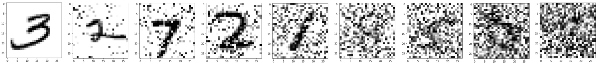
Surprisingly, despite higher noise, deep neural networks show an ability to be trained effectively in recognizing these digits.

## Dataset
This study uses a dataset for CSCE 636 Deep Learning class, which cannot be publicly shared. Both the train and test datasets have higher noise levels compared to the shown images. A portion (20%) of the train dataset was randomly reserved for testing.

## Training
* Used categorical_entropy as the loss function and Adam as optimizer.
* Model was trained for 100 epochs and best weights were saved according validation loss values.
* Used batch size of 64 and cross validation split of 0.2.
* Variable learning rate (reduce factor of 0.1) was used with a patience of 5 based on validation loss value.

## Experiments
### Set 1 : Use multiple convolutional, maxpooling and dropout layers
#### Keep same padding for all layers. Keep filter size from 4 to 512 in convolutional layers.
* 7 (conv + maxpooling + dropout 0.5), 1 conv, 1 flatten
* *Gives 11% test accuracy*

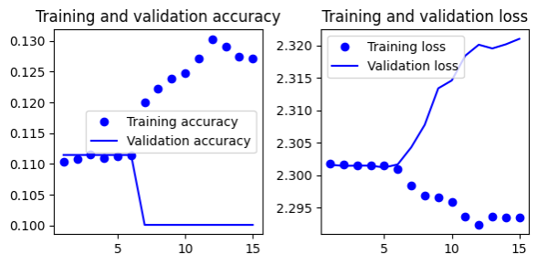

#### Keep same padding for all layers. Keep filter size from 16 to 512 in convolutional layers.
5 (conv + maxpooling + dropout 0.5), 1 conv, 1 flatten
* *Gives 11% test accuracy*

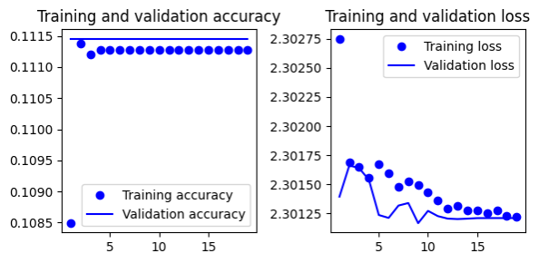

#### Remove padding for convolutional layers. Keep filter size from 32 to 128 in convolutional layers. Reduce number of layers.
* 2 (conv + maxpooling + dropout 0.5), 1 conv, 1 flatten
* *Gives 66.6% test accuracy*

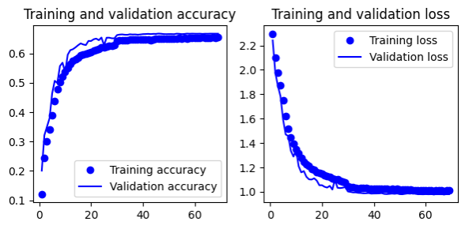

#### Add regularization to make model robust
* Remove padding for convolutional layers
* Keep filter size from 32 to 128 in convolutional layers
* Change dropout percentage
* Add L2 regularization
* *Gives 62.8% test accuracy*

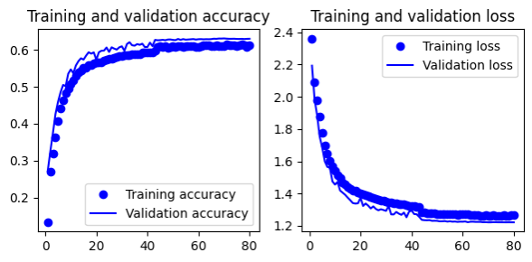

### Set 2: Use convolutional, maxpooling, dense and dropout layers.
#### Remove padding for convolutional layers. Keep filter size from 32 to 128 in convolutional layers. Add a dense layer.
* 2 (conv + maxpooling + dropout 0.5), 1 conv, 1 flatten, 1 dense
* *Gives 66.3% test accuracy*

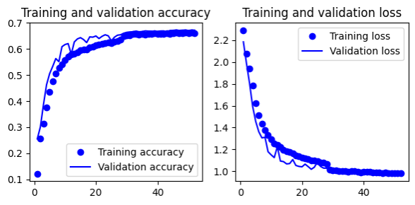

#### Remove padding for convolutional layers. Keep filter size from 16 to 64 in convolutional layers. Add a dense layer
* 2 (conv + maxpooling + dropout 0.5), 1 conv, 1 flatten, 1 dense
* *Gives 62.8% test accuracy*

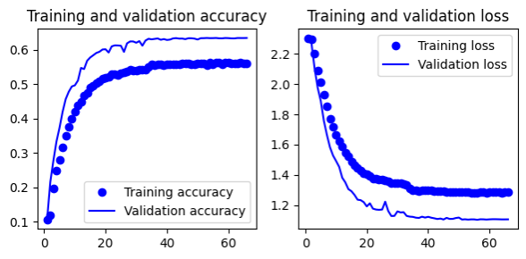

#### Remove padding for convolutional layers. Keep filter size from 16 to 64 in convolutional layers. Add 2 dense layers
* 2 (conv + maxpooling + dropout 0.5), 1 conv, 1 flatten, 2 dense
* *Gives 65.9% test accuracy*

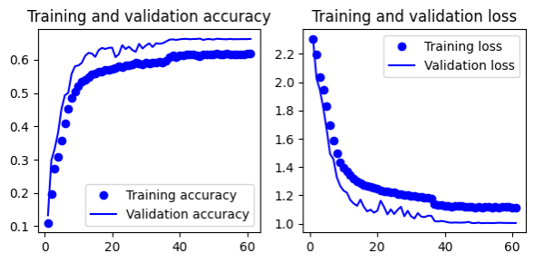

#### Try fine tuning the best set 2 model obtained so far
* Remove padding for convolutional layers
* Keep filter size from 32 to 128 in convolutional layers
* Use droput 0.5
* Increase size of dense layer = 256
* *Gives 66.5% test accuracy*

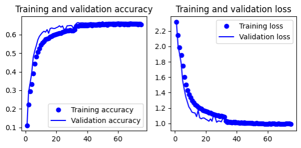

### Set 3: Inspiration from [this](https://towardsdatascience.com/going-beyond-99-mnist-handwritten-digits-recognition-cfff96337392) article.
* Use stacked convolutional layers, batchnormalization, activation layers, maxpooling, dropout and dense layers
* *Gives 65.9% test accuracy*

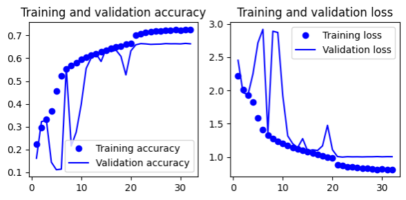

#### Add preprocessing step 
* *Gives 65.9% test accuracy*

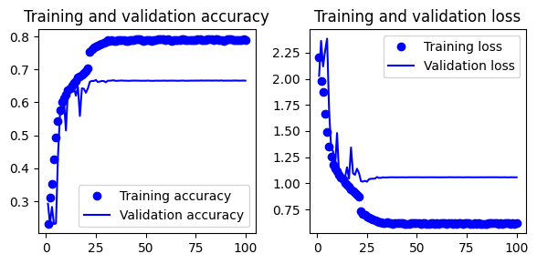

#### Add preprocessing step and update layer parameters
* *Gives 69.3% test accuracy*

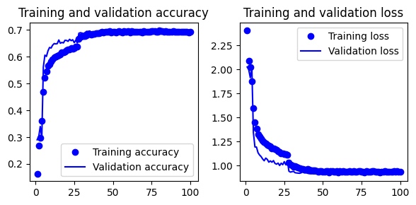

#### Add preprocessing step and remove some layers, change regularization
* *Gives 69.3% test accuracy*

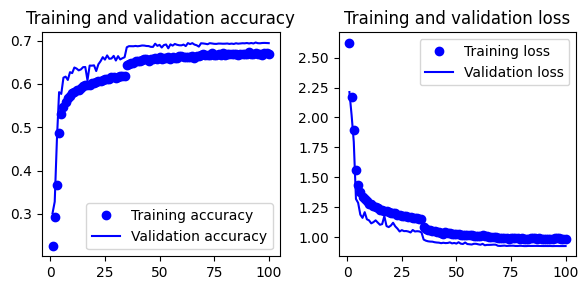

### Set 4: Inspiration from [this](https://machinelearningmastery.com/how-to-improve-deep-learning-model-robustness-by-adding-noise/) article.
#### Add Gaussian Noise as layers.
* *Gives 69.3% test accuracy*

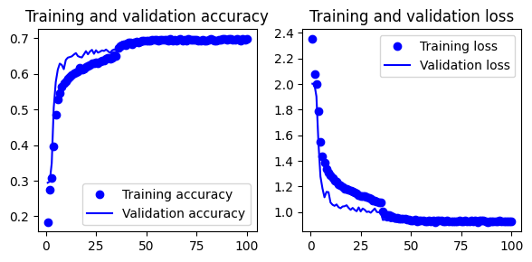

### Set 5: Removing noise using KNN (inspiration from [this](https://medium.com/nerd-for-tech/recovering-the-original-image-from-the-image-having-noise-using-knn-mnist-handwritten-digit-530edf39587e) article).
* This approach does not work at all on the given dataset.
* Here is how images look before and after applying KNN.

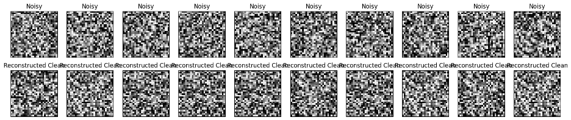

### Set 6: Training with clean MNIST dataset together.
* Combine clean MNIST images and noisy images together and train a model
* *Gives 9.9% test accuracy*

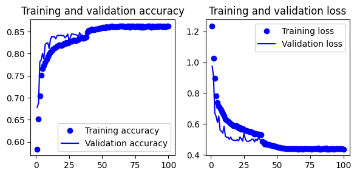

## Final Model
After all different experiments and results obtained, I decided to consider the following as the final model.
###   Preprocessing:
    1. Reshape each image
    2. Convert to float and normalize
    3. Convert to numpy array
    4. Add padding to make images 32x32 size
    5. Standardize each pixel using mean and standard deviation
    6. One hot encoding for labels (10 classes)

###   Deep Learning Model:
    1. Convolutional layer with 32 filters, a kernel size of 5, ReLU activation, and L2 regularization for an input shape of 32x32x1.
    2. Convolutional layer with 32 filters, a kernel size of 5, and no bias terms.
    3. Add batch normalization to the previous layer.
    4. Apply the ReLU activation function to the output of the batch normalization.
    5. Implement max-pooling with a pool size of 2x2 and a stride of 2.
    6. Apply dropout regularization with a rate of 0.5.
    7. Add another convolutional layer with 64 filters, a kernel size of 3, ReLU activation, and L2 regularization.
    8. Create another convolutional layer with 64 filters, a kernel size of 3, and no bias terms.
    9. Add batch normalization to the previous layer.
    10. Apply the ReLU activation function to the output of the batch normalization.
    11. Implement max-pooling with a pool size of 2x2 and a stride of 2.
    12. Apply dropout regularization with a rate of 0.5.
    13. Flatten the output of the previous layers.
    14. Create a dense (fully connected) layer with 256 units and no bias terms.
    15. Add batch normalization to the dense layer.
    16. Apply the ReLU activation function to the output of the batch normalization.
    17. Create another dense layer with 128 units and no bias terms.
    18. Add batch normalization to the dense layer.
    19. Apply the ReLU activation function to the output of the batch normalization.
    20. Create a final dense layer with 64 units and no bias terms.
    21. Add batch normalization to the dense layer.
    22. Apply the ReLU activation function to the output of the batch normalization.
    23. Apply dropout regularization with a rate of 0.5.
    24. Add final output layer as a dense layer with 10 units.

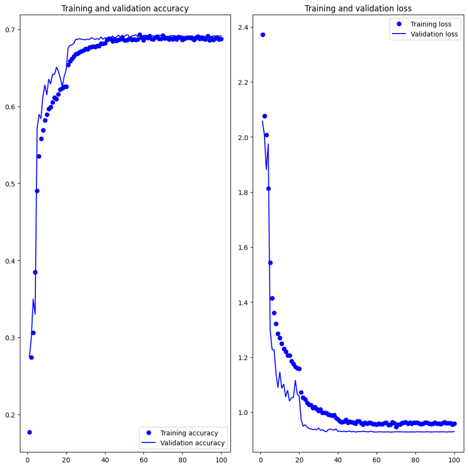

## Testing
- Final testing was conducted by course officials.
- **Accuracy on actual train dataset:** 74.01%
- **Accuracy on actual test dataset:** 69.7%
- The trained model will be made available upon request.

## Lessons Learned
- Using variable learning rates during training proves more effective than early stopping, especially when overfitting is likely due to training data.
- Padding in convolutional layers can sometimes negatively impact model performance.
- Dropout regularization should not be overlooked.
- Sequentially increasing the convolutional filter size across layers yields better results.
- Too many dense layers after convolutional layers can harm model performance.
- Batch normalization is beneficial.
- Incorporating extra noise, like Gaussian noise, into the model can improve robustness.
- Establish a basic code structure for experiments; validate it with a small dataset subset before conducting experiments.

## Acknowledgements
- [Deep Learning with Python Notebooks by fchollet](https://github.com/fchollet/deep-learning-with-python-notebooks/blob/master/chapter05_fundamentals-of-ml.ipynb)
- [Going Beyond 99% MNIST Handwritten Digits Recognition](https://towardsdatascience.com/going-beyond-99-mnist-handwritten-digits-recognition-cfff96337392)
- [How to Improve Deep Learning Model Robustness by Adding Noise](https://machinelearningmastery.com/how-to-improve-deep-learning-model-robustness-by-adding-noise/)
- [Recovering the Original Image from the Image Having Noise Using KNN MNIST Handwritten Digit](https://medium.com/nerd-for-tech/recovering-the-original-image-from-the-image-having-noise-using-knn-mnist-handwritten-digit-530edf39587e)
- **Professor Anxiao (Andrew) Jiang and Teaching Assistant Xiaotian Han:** For guidance, support, and valuable insights throughout this project.

